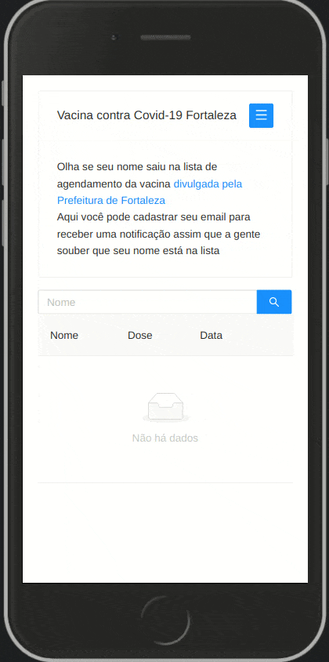

# Vaccine Schedule Fortaleza


Is a Django/React JS project to find out if your name is in Fortaleza schedule list to get vaccinated and to register your email to receive a notification when scheduled.

:raised_back_of_hand: Disclaimer: As this is a hobby project I didn't mind to serve the frontend with Django (not ideal).

## Live demo

http://vacina-fortaleza.herokuapp.com/



## Requirements

- Docker 19.03.6+
- Compose 1.24.1+

### Technologies used

- Django Rest Framework
- React JS
 
## Setup
    
```bash
docker-compose -f docker-compose.dev.yml up --build --remove-orphans
```

## Contributing

Pull requests are welcome.

## License

[MIT](https://choosealicense.com/licenses/mit/)


## Useful Links:

- https://coronavirus.fortaleza.ce.gov.br/agendados.html
- https://www.opovo.com.br/coronavirus/2021/07/05/agendamento-para-vacinacao-em-fortaleza-deve-ser-conferido-no-vacine-ja-ou-nas-listas-da-prefeitura.html
- https://coronavirus.fortaleza.ce.gov.br/lista-vacinacao-d1.html
- https://coronavirus.fortaleza.ce.gov.br/lista-vacinacao-d1.js
- https://spreadsheets.google.com/feeds/list/1IJBDu8dRGLkBgX72sRWKY6R9GfefsaDCXBd3Dz9PZNs/14/public/values
